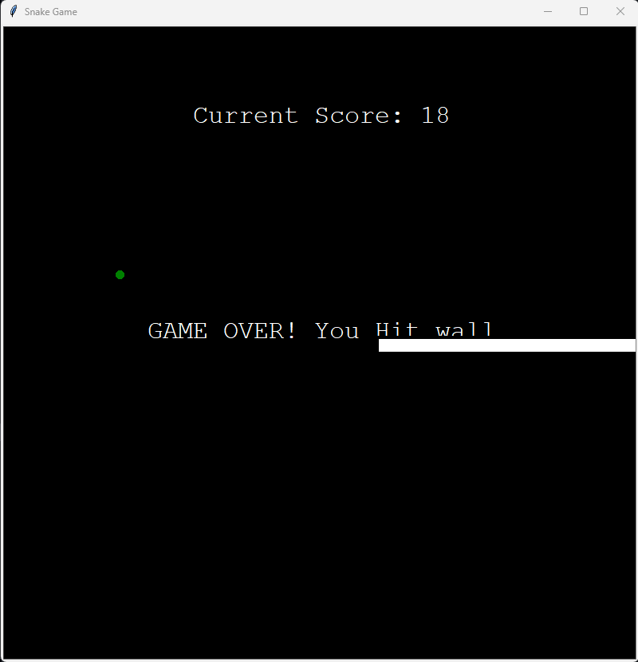

## Snake Game using turtle module in python

- This is a simple snake game using turtle module in python. Important python modules used in this project are turtle, random, tkinter, and time.
- The snake game is a single-player game. The objective of the game is to feed the snake with food that randomly appears on the screen. The snake grows in length as it eats the food. The game ends when the snake either collides with the wall or with itself.

## How to play the game

- The snake can be controlled using the arrow keys on the keyboard.
- The game can be restarted by pressing the enter key.
- The game can be exited by clicking on the screen.

> Below is the snapshot of the game.

